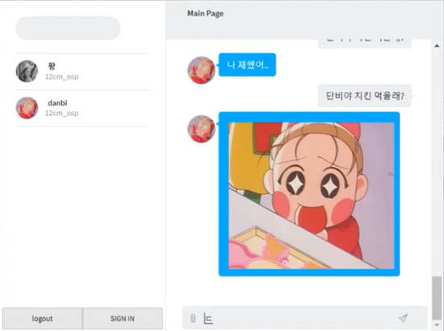

# Danbi - Bot 

## 다양한 챗봇 기능을 가진 채팅 웹 

 - 챗봇 활성화 / 비활성화 
 - 사용자 채팅방 출입시 챗봇이 응답
 - 채팅방 내 스케쥴러
 - 대화 패턴 학습
 - 상황별 이미지/ 음성 응답 
### server.js
 - 채팅웹 서버 
### views.js 
 - 채팅 뷰 
### Assets/js
 - front end 기능  
### public 
 - image/ voice 파일 저장 

## 사용 예시 영상 
 - 봇 활성화/ 비활성화 : https://www.youtube.com/watch?v=mnxiDNcbcUg&list=PLzPqOMXZwxiBOH5bR86ip_1YwtXzW-tfG
 - 로그인 : https://www.youtube.com/watch?v=5mdYmClkk8w&list=PLzPqOMXZwxiBOH5bR86ip_1YwtXzW-tfG&index=5
 - 봇 대화 패턴 학습 : https://www.youtube.com/watch?v=00qiETBrg2I&list=PLzPqOMXZwxiBOH5bR86ip_1YwtXzW-tfG&index=2
 - 사진 음성 출력 : https://www.youtube.com/watch?v=4qdFMprvJXE&list=PLzPqOMXZwxiBOH5bR86ip_1YwtXzW-tfG&index=3
 - 스케쥴러 : https://www.youtube.com/watch?v=LFU95pcLrsM&list=PLzPqOMXZwxiBOH5bR86ip_1YwtXzW-tfG&index=4
